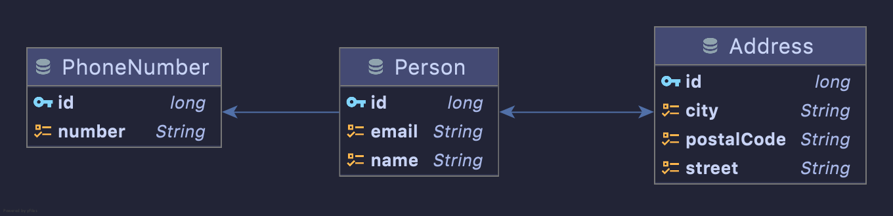

# Contactos Kotlin JPA
Ejemplos de una aplicación de manejo de contactos con Kotlin y JPA. Usando para testear la aplicación JUnit 5 y Mockito. Almacenamiento en base de datos relacional H2.

## Acerca de
Este ejemplo de clase pensado para Acceso a Datos, muestra como consumir una base de datos relacional usando JPA con Hibernate. Además se ha mostrado el uso de JUnit 5 y Mockito para testear algunos elementos. Finalmente tambien se mapean objetos y se convierten a JSON para entrada y salida de la información.

## Enunciado
En persona puede tener dirección o no, incluso varias direcciones. De la misma manera puede tener o no tener uno o varios teléfonos. Una dirección en un instante solo puede estar ocupada por una persona, y un teléfono sólo pertenece a una persona.

Además, dada una persona sabremos su direcciones y teléfonos, si los hay, pero también dada una dirección necesitamos saber qué persona vive allí. (Por ejemplo, si una persona tiene una dirección en Madrid, podemos saber a qué persona esa dirección pertenece). Para los teléfonos no es el caso.

Se implementa una arquitectura basada en Controlador -> Servicios -> Repositorio, siguiendo los [ejemplos vistos en clase](https://github.com/joseluisgs?tab=repositories&q=blog&type=&language=&sort=). Nos centramos en Persona, aunque gracias a JPA, al pasar un objeto persona con sus datos completos se insertan los datos correspondientes en las tablas indicadas según el diseño de objetos.

### Diagrama

## Autor

Codificado con :sparkling_heart: por [José Luis González Sánchez](https://twitter.com/joseluisgonsan)

### Contacto

  Cualquier cosa que necesites házmelo saber por si puedo ayudarte 💬.

     &nbsp;&nbsp;
     &nbsp;&nbsp;
      &nbsp;&nbsp;
    

## Licencia

Este proyecto está licenciado bajo licencia **MIT**, si desea saber más, visite el fichero [LICENSE](./LICENSE) para su uso docente y educativo.